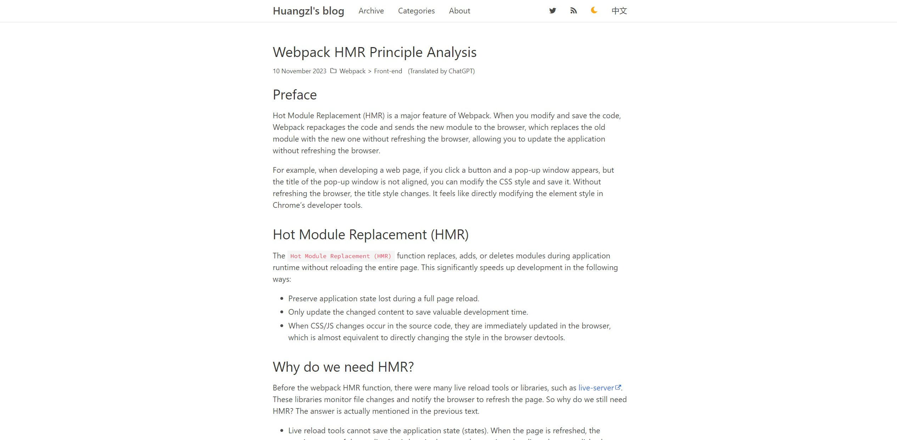

# Blog Development

## Overview



Visit my blog: [ikkkp.github.io](ikkkp.github.io)

This repository contains the source code for my personal blog, built using Hexo. Below are the key commands for development, deployment, and additional tools.

based on:[huli](https://github.com/aszx87410) 

theme:[hexo-theme-minos](https://github.com/aszx87410/hexo-theme-minos)

## Getting Started

1. Clone the repository:

    ```bash
    git clone git@github.com:ikkkp/hexo-based-profile.git
    ```

2. Install dependencies:

    ```bash
    npm install
    ```

3. Start the development server:

    ```bash
    hexo server
    ```

4. Create a new blog post:

    ```bash
    hexo new post my-new-blog
    ```

## Deployment

To deploy the blog, use the following commands:

```bash
hexo clean
hexo deploy
```

## Generating OG Image

Generate an Open Graph (OG) image for a specific blog post:

```bash
npm run og-image -- "redos-regular-expression-denial-of-service"
```

## Translation

Translate blog content using either GitHub Copilot or OpenAI translation API:


### Using GitHub Copilot
github copilot

### Using OpenAI API
```bash
# Using OpenAI API (provide your API key)
OPENAI_API_KEY=sk-xxx
npm run translate
```

## Version Information

The project is up-to-date with the latest versions, and it is compatible with Node.js v20.

Feel free to explore and contribute to the blog development!

---

Feel free to customize it further based on your specific needs.